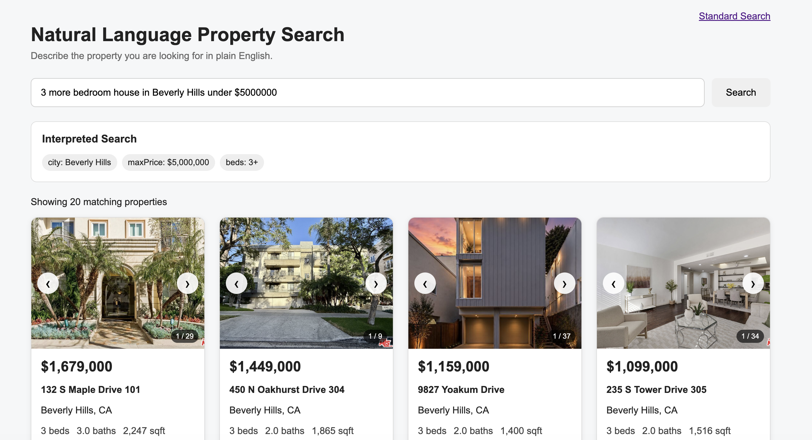

# IDX Exchange Property Search

A full-stack real estate search application developed during the IDX Exchange SDE Internship.

The application allows users to browse and filter property listings, view detailed property information, inspect property photos and open-house schedules, and search for homes using natural-language queries.

The natural-language search feature uses the Anthropic API to translate requests such as:

> "3 bedroom house in Beverly Hills under $5,000,000"

into structured property filters. The extracted filters are validated before they are passed to the database search layer.

---

## Screenshot



> Before final submission, add a screenshot of the running application at `docs/screenshots/property-search.png`.

---

## Features

- Browse property listings
- Search by city and ZIP code
- Filter by minimum and maximum price
- Filter by minimum bedrooms and bathrooms
- Filter by year-built range
- Paginated property results
- Property detail pages
- Property photo carousel and gallery
- Open-house information
- Natural-language property search
- AI-generated filter validation
- Request logging with response time
- React Error Boundary with recovery UI
- Input validation and HTTP error handling
- Backend API tests with Jest and Supertest
- Frontend component tests with Jest and React Testing Library

---

# Tech Stack

## Frontend

- React
- React Router
- PropTypes
- React Testing Library
- Jest
- CSS

## Backend

- Node.js 20
- Express 5
- MySQL 8
- mysql2
- Anthropic SDK
- CORS
- dotenv
- node-fetch
- Jest
- Supertest

## Development Tools

- Docker
- Git
- GitHub
- npm

Exact dependency versions are available in:

```text
backend/package.json
frontend/package.json
```

---

# Project Structure

```text
IDX-Exchange-SDE-Intern-Summer-2026/
├── backend/
│   ├── __tests__/
│   │   ├── naturalSearch.test.js
│   │   └── properties.test.js
│   │
│   ├── middleware/
│   │   └── logger.js
│   │
│   ├── routes/
│   │   ├── naturalSearch.js
│   │   └── properties.js
│   │
│   ├── services/
│   │   └── propertySearch.js
│   │
│   ├── utils/
│   │   └── validatePropertyFilters.js
│   │
│   ├── app.js
│   ├── db.js
│   ├── server.js
│   └── package.json
│
├── frontend/
│   ├── src/
│   │   ├── api/
│   │   ├── components/
│   │   ├── hooks/
│   │   ├── pages/
│   │   └── utils/
│   │
│   └── package.json
│
└── README.md
```

---

# Local Setup

The following instructions describe how to run the project on a fresh development machine.

## Prerequisites

Install:

- Git
- Node.js 20
- npm
- MySQL 8
- Docker / Docker Desktop if using the project's containerized MySQL environment

Verify the required tools:

```bash
git --version
node --version
npm --version
```

If using Docker:

```bash
docker --version
```

The recommended Node.js major version for this project is:

```text
Node.js 20
```

---

## 1. Clone the Repository

```bash
git clone <repository-url>
cd IDX-Exchange-SDE-Intern-Summer-2026
```

Replace `<repository-url>` with the repository's Git URL.

---

# Backend Setup

## 2. Install Backend Dependencies

From the project root:

```bash
cd backend
npm install
```

---

## 3. Configure Environment Variables

Create:

```text
backend/.env
```

The backend database connection uses the following environment variables:

```env
DB_HOST=localhost
DB_PORT=3306
DB_USER=root
DB_PASSWORD=password
DB_NAME=rets

PORT=5000

ANTHROPIC_API_KEY=your_anthropic_api_key
```

The database configuration is loaded by `backend/db.js`:

```js
const pool = mysql.createPool({
  host: process.env.DB_HOST,
  port: Number(process.env.DB_PORT),
  user: process.env.DB_USER,
  password: process.env.DB_PASSWORD,
  database: process.env.DB_NAME,
  waitForConnections: true,
  connectionLimit: 10,
  queueLimit: 0,
});
```

Replace the example values with the credentials for your local MySQL environment.

`ANTHROPIC_API_KEY` is required only for the natural-language search feature.

Never commit real API keys, passwords, or other secrets to Git.

---

## 4. Start MySQL

The backend expects a MySQL database containing the RETS property dataset.

The default example configuration is:

```text
Host:     localhost
Port:     3306
Database: rets
```

If MySQL is running through Docker, make sure the MySQL container is running before starting the backend.

You can check running containers with:

```bash
docker ps
```

For example, if the local MySQL container is named `idx-mysql-local`, the MySQL client can be opened with:

```bash
docker exec -it idx-mysql-local mysql -uroot -p rets
```

Enter the configured MySQL password when prompted.

---

## 5. Start the Backend

From:

```text
backend/
```

run:

```bash
npm start
```

For development with automatic restart:

```bash
npm run dev
```

By default, the API runs at:

```text
http://localhost:5000
```

The port can be changed using the `PORT` environment variable.

---

## 6. Verify the Backend

Open:

```text
GET /api/health
```

or run:

```bash
curl http://localhost:5000/api/health
```

A successful response looks like:

```json
{
  "status": "ok",
  "database": "connected"
}
```

If MySQL cannot be reached, the endpoint returns HTTP `500`.

---

# Frontend Setup

## 7. Install Frontend Dependencies

Open another terminal from the project root:

```bash
cd frontend
npm install
```

---

## 8. Start the Frontend

Run:

```bash
npm start
```

The React development server normally runs at:

```text
http://localhost:3000
```

Open that address in a browser.

Make sure the backend is also running before performing property searches.

---

# API Reference

## Health Check

### `GET /api/health`

Checks whether the backend can communicate with MySQL.

Example:

```bash
curl http://localhost:5000/api/health
```

Successful response:

```json
{
  "status": "ok",
  "database": "connected"
}
```

---

# Property Search

## `GET /api/properties`

Returns property listings using optional filters and offset-based pagination.

### Query Parameters

| Parameter | Description |
|---|---|
| `city` | Exact city match, case-insensitive |
| `zipcode` | ZIP code |
| `minPrice` | Minimum listing price |
| `maxPrice` | Maximum listing price |
| `beds` | Minimum number of bedrooms |
| `baths` | Minimum number of bathrooms |
| `minYearBuilt` | Minimum construction year |
| `maxYearBuilt` | Maximum construction year |
| `limit` | Number of results to return; default 20, maximum 100 |
| `offset` | Number of matching rows to skip; default 0 |

### Example Request

```bash
curl "http://localhost:5000/api/properties?city=Beverly%20Hills&minPrice=1000000&maxPrice=5000000&beds=3&baths=2&minYearBuilt=2000&limit=20&offset=0"
```

### Example Response

```json
{
  "total": 8,
  "limit": 20,
  "offset": 0,
  "results": [
    {
      "L_ListingID": "12345",
      "L_Address": "123 Example Street",
      "L_City": "Beverly Hills",
      "L_State": "CA",
      "L_Zip": "90210",
      "L_SystemPrice": 2500000,
      "L_Keyword2": 3,
      "LM_Dec_3": 2.5,
      "LM_Int2_3": 1800,
      "YearBuilt": 2005,
      "L_Photos": "..."
    }
  ]
}
```

### Validation

The API validates pagination and numeric filters before querying MySQL.

Examples of invalid requests include:

```text
limit > 100
offset < 0
negative price
negative bedroom count
invalid bathroom value
year outside 1800–2100
minYearBuilt > maxYearBuilt
```

Invalid parameters return HTTP `400`.

---

# Property Details

## `GET /api/properties/:id`

Returns the complete database record for one property.

### Example Request

```bash
curl http://localhost:5000/api/properties/12345
```

### Successful Response

```json
{
  "L_ListingID": "12345",
  "L_Address": "123 Example Street",
  "L_City": "Beverly Hills",
  "L_State": "CA",
  "L_SystemPrice": 2500000
}
```

The actual response may contain additional fields from `rets_property`.

### Unknown Property

HTTP `404`:

```json
{
  "error": "Property not found"
}
```

### Invalid Listing ID

HTTP `400`:

```json
{
  "error": "Invalid listing ID"
}
```

---

# Open Houses

## `GET /api/properties/:id/openhouses`

Returns open-house records associated with an existing property.

### Example Request

```bash
curl http://localhost:5000/api/properties/12345/openhouses
```

### Example Response

```json
[
  {
    "L_ListingID": "12345",
    "OpenHouseDate": "2026-08-30",
    "OH_StartTime": "13:00:00",
    "OH_EndTime": "15:00:00",
    "OH_StartDate": "2026-08-30",
    "OH_EndDate": "2026-08-30"
  }
]
```

If the property exists but has no scheduled open houses:

```json
[]
```

If the property itself does not exist, the API returns HTTP `404`:

```json
{
  "error": "Property not found"
}
```

Invalid listing IDs return HTTP `400`.

---

# Natural-Language Search

## `POST /api/search/natural`

Allows users to describe the property they want using natural language.

The backend sends the query to the Anthropic API and requests structured filters in the following format:

```json
{
  "city": null,
  "zipcode": null,
  "minPrice": null,
  "maxPrice": null,
  "beds": null,
  "baths": null,
  "minYearBuilt": null,
  "maxYearBuilt": null
}
```

The model output is parsed and validated before any extracted filters are allowed to reach the database search layer.

### Example Request

```bash
curl \
  -X POST \
  http://localhost:5000/api/search/natural \
  -H "Content-Type: application/json" \
  -d '{
    "query": "3 bedroom house in Beverly Hills under $5000000"
  }'
```

### Example Interpreted Filters

```json
{
  "city": "Beverly Hills",
  "maxPrice": 5000000,
  "beds": 3
}
```

### Example Response

```json
{
  "query": "3 bedroom house in Beverly Hills under $5000000",
  "interpretedFilters": {
    "city": "Beverly Hills",
    "maxPrice": 5000000,
    "beds": 3
  },
  "total": 8,
  "limit": 20,
  "offset": 0,
  "results": []
}
```

If no supported filters can be identified, the API returns a successful response with no results:

```json
{
  "message": "I could not identify any supported property filters from that search.",
  "interpretedFilters": {},
  "total": 0,
  "limit": 20,
  "offset": 0,
  "results": []
}
```

If the Anthropic API is unavailable, the endpoint returns HTTP `503`:

```json
{
  "error": "Natural language search is temporarily unavailable."
}
```

Malformed or invalid model responses are rejected rather than being sent directly to the database.

---

# Database Schema Summary

The application primarily reads property data from two MySQL tables:

```text
rets_property
rets_openhouse
```

---

## `rets_property`

Stores real estate listing information.

Important columns used by the application include:

| Column | Purpose |
|---|---|
| `id` | Internal table identifier |
| `L_ListingID` | Property listing identifier |
| `L_Address` | Street address |
| `L_City` | City |
| `L_State` | State |
| `L_Zip` | ZIP code |
| `L_SystemPrice` | Listing price |
| `L_Keyword2` | Bedroom count |
| `LM_Dec_3` | Bathroom count |
| `LM_Int2_3` | Square footage |
| `YearBuilt` | Construction year |
| `L_Photos` | Property photo data |
| `L_Remarks` | Listing remarks |

The application filters this table using combinations of location, price, bedrooms, bathrooms, and construction year.

Frequently queried fields are indexed where appropriate to improve search performance.

---

## `rets_openhouse`

Stores open-house records.

Important columns include:

| Column | Purpose |
|---|---|
| `L_ListingID` | Associated property listing ID |
| `OpenHouseDate` | Open-house date |
| `OH_StartTime` | Start time |
| `OH_EndTime` | End time |
| `OH_StartDate` | Start date |
| `OH_EndDate` | End date |
| `all_data` | Additional source data |

---

## Relationship

The application associates the two tables through `L_ListingID`:

```text
rets_property
     |
     | L_ListingID
     |
     | 1
     |
     +--------------------<
                           many
                     rets_openhouse
```

A property may have zero, one, or multiple open-house records.

The API verifies that a property exists before returning its open-house records. This allows the API to distinguish:

```text
Existing property with no open houses
→ HTTP 200 []

Unknown property
→ HTTP 404
```

---

# Database Connection

The backend uses a `mysql2/promise` connection pool:

```js
const pool = mysql.createPool({
  host: process.env.DB_HOST,
  port: Number(process.env.DB_PORT),
  user: process.env.DB_USER,
  password: process.env.DB_PASSWORD,
  database: process.env.DB_NAME,
  waitForConnections: true,
  connectionLimit: 10,
  queueLimit: 0,
});
```

A connection pool is used so requests can reuse database connections rather than creating a new MySQL connection for every API request.

---

# Performance Optimization

Property filtering uses parameterized SQL queries and database indexes.

The application uses `EXPLAIN` and `EXPLAIN ANALYZE` to inspect MySQL query execution plans for complex property searches.

A representative complex filter includes:

```text
city
price range
minimum bedrooms
minimum bathrooms
minimum year built
```

The query execution plan can be used to inspect:

- selected indexes
- access type
- estimated rows
- filtering percentage
- index conditions
- additional query execution behavior

Composite and individual indexes can then be evaluated based on real query patterns.

---

# Request Logging

The backend includes request logging middleware.

Each completed request records:

```text
HTTP method
request URL
HTTP status
response time in milliseconds
```

Example:

```text
GET /api/properties?city=Portland 200 4ms
```

Response time is measured when the response finishes so the log reflects the complete request lifecycle.

---

# Error Handling

## Backend

The API uses appropriate HTTP status codes for common failures.

| Status | Meaning |
|---|---|
| `200` | Successful request |
| `400` | Invalid request input |
| `404` | Property not found |
| `500` | Unexpected server/database failure |
| `503` | Natural-language search service unavailable or invalid AI response |

Database and Anthropic errors are handled without exposing uncontrolled failures directly to the frontend.

---

## Frontend

The React application includes an Error Boundary.

If a descendant component throws during rendering, the Error Boundary catches the error and displays a recovery interface instead of leaving the application in a broken state.

The recovery UI allows the user to reload the application.

---

# Testing

The project includes automated backend and frontend tests.

---

## Backend Tests

Backend API tests use:

```text
Jest
Supertest
```

The MySQL pool and external AI behavior are mocked where appropriate so automated tests do not require live database queries or Anthropic API requests.

Run:

```bash
cd backend
npm test
```

Current backend suite:

```text
Test Suites: 2 passed
Tests:       24 passed
```

Generate coverage:

```bash
npm run test:coverage
```

Current critical route coverage includes:

```text
backend/routes       83%+ line coverage
naturalSearch.js     97%+ line coverage
properties.js        76%+ line coverage
```

Backend tests cover:

- default property retrieval
- pagination
- city filtering
- ZIP-code filtering
- price filtering
- bedroom filtering
- bathroom filtering
- invalid parameters
- property detail success
- unknown property
- invalid listing ID
- open-house results
- empty open-house results
- unknown-property open-house request
- natural-language query validation
- valid natural-language searches
- Markdown-fenced model responses
- unsupported natural-language queries
- Anthropic API failures
- missing model output
- malformed model JSON
- downstream property-search failures

---

## Frontend Tests

Frontend tests use:

```text
Jest
React Testing Library
```

Run:

```bash
cd frontend
npm test -- --watchAll=false
```

Generate coverage:

```bash
npm test -- --coverage --watchAll=false
```

Current frontend suite:

```text
Test Suites: 6 passed
Tests:       23 passed
```

Critical component coverage includes:

```text
PropertyFilters.jsx   100% line coverage
Pagination.jsx         86%+ line coverage
PropertyCard.jsx       100% line coverage
```

Frontend tests cover:

- filter rendering and behavior
- filter reset behavior
- pagination controls
- pagination boundaries
- property information rendering
- property-card navigation
- keyboard navigation
- fallback property values
- photo parsing
- API client behavior
- Error Boundary behavior

---

# Production Build

To verify that the frontend can be compiled for production:

```bash
cd frontend
npm run build
```

The command creates an optimized production build in:

```text
frontend/build/
```

---

# Known Issues

- Natural-language search requires a valid Anthropic API key and network connectivity.
- Natural-language queries can be ambiguous, and the interpreted filters may not always exactly match user intent.
- Natural-language search availability depends on the external Anthropic service.
- Property data quality and completeness depend on the underlying RETS dataset.
- Some listings may not contain usable photos.
- Some property records may have missing optional metadata.
- Not every property has an associated open-house record.
- Search performance can vary depending on dataset size and filter combinations.
- Local development requires access to the RETS MySQL dataset.
- Automated coverage is concentrated on critical routes and components rather than every page and secondary UI component.

---

# Future Improvements

Potential future work includes:

- Increase test coverage for full React pages and secondary components.
- Add end-to-end browser tests.
- Add integration tests against a dedicated test database.
- Add continuous integration for linting, testing, and builds.
- Add sorting by price, date, bedrooms, and other property attributes.
- Add saved searches.
- Add favorite-property functionality.
- Add user accounts and authentication.
- Improve natural-language handling for ambiguous searches.
- Support more natural-language property attributes.
- Add caching for frequently repeated searches.
- Continue optimizing composite indexes using production query patterns.
- Improve mobile responsiveness.
- Improve accessibility and keyboard interaction.
- Add more robust loading and retry states.
- Add deployment automation and production monitoring.

---

# Development Workflow

Development uses Git feature branches and pull requests.

Feature, test, refactor, documentation, and maintenance work is performed on dedicated branches and merged into `develop`.

Conventional-style commit messages are used where appropriate.

Examples:

```text
feat(filters): implement property search filters
test(components): add PropertyCard tests
test(utils): add photo parsing tests
fix(lint): resolve lint errors
docs(github): add pull request template
refactor(frontend): organize source directories
chore(code): remove debug logs and dead comments
```

Changes should not be committed directly to `main`.

Before merging a branch, run the appropriate tests, lint checks, and production build.

---

# Security Notes

- Never commit `.env` files containing real credentials.
- Never commit the Anthropic API key.
- Database credentials should be provided through environment variables.
- User-supplied property filters are passed to MySQL through parameterized query values rather than direct SQL interpolation.
- AI-generated filters are validated before reaching the database search layer.

---

# License

This project was developed as part of the IDX Exchange SDE Internship program.